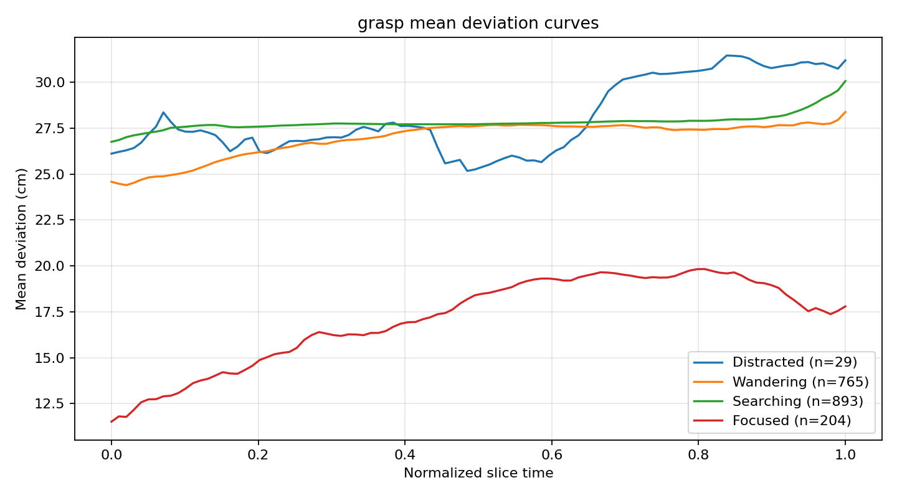
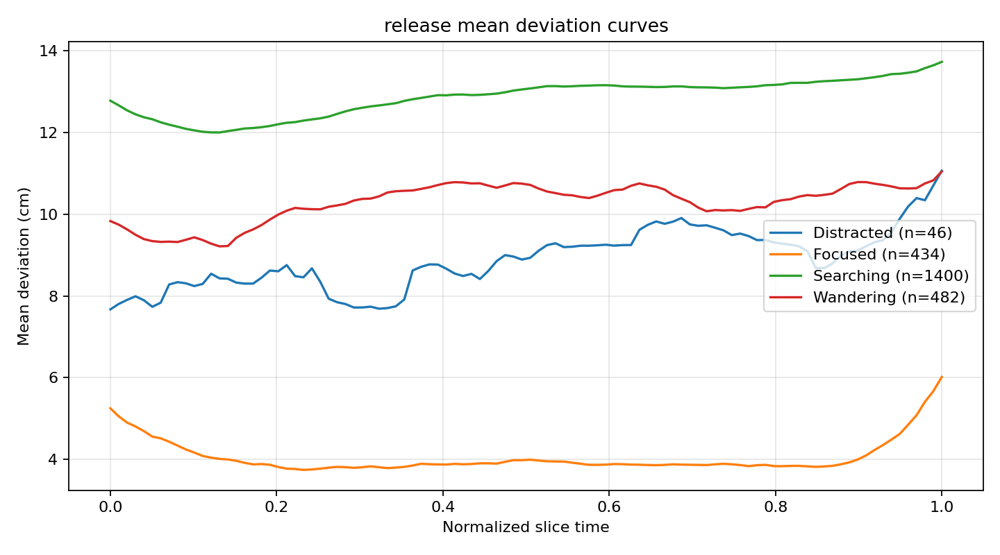

# GAIPAT 注视序列数据处理流程

本项目基于 GAIPAT 数据集进行注视视线与注意状态分析。当前代码重点完成从原始 GAIPAT 数据到定长 JSONL 序列、聚类、重打标签的完整预处理流程。

GAIPAT 是一个用于装配任务意图预测的数据集，包含参与者在 LEGO Duplo 装配任务中的桌面注视点、屏幕注视点、瞳孔信息、事件、任务状态和成功/失败标签。

## 目录说明

```text
preprocess_script/
  01_extract_unified_data_pipeline.py
  02_slice_dataframes.py
  03_compute_block_deviation_sequences.py
  04_cluster_deviation_sequences.py
  05_normalize_deviation_jsonl_sequences.py
  06_relabel_sequences_from_clusters.py

cluster.md
README.md
```

主要中间结果目录通常为：

```text
extract_unified_data/
slice_dataframes/
block_deviation_sequences/
cluster_results/
normalized_deviation_jsonl_sequences/
relabelled_sequences/
```

## 整体流程

### 01 构建统一 master dataframe

脚本：

```bash
python preprocess_script/01_extract_unified_data_pipeline.py --repo-root /path/to/gaipat
```

作用：

- 读取 GAIPAT 原始目录中的 `participants/` 和 `setup/`。
- 合并 table/screen gaze、pupil、event、state、instruction 等信息。
- 输出每个参与者每个任务的统一 master CSV。

默认输出：

```text
extract_unified_data/
```

### 02 按 step / block / event 切片

脚本：

```bash
python preprocess_script/02_slice_dataframes.py \
  --repo-root /path/to/gaipat \
  --input-dir /path/to/gaipat/extract_unified_data \
  --output-dir /path/to/gaipat/slice_dataframes
```

作用：

- 将 master dataframe 按 `step_id + block_id + event` 切成较短的时序片段。
- 文件名格式为：

```text
[subject_id]_[task]_[step]_[event]_[block_id]_[label].csv
```

其中 `label=1` 表示原始成功样本，`label=0` 表示原始失败样本。

### 03 计算注视偏差序列

脚本：

```bash
python preprocess_script/03_compute_block_deviation_sequences.py \
  --repo-root /path/to/gaipat \
  --input-dir /path/to/gaipat/slice_dataframes \
  --output-dir /path/to/gaipat/block_deviation_sequences \
  --include-failures
```

作用：

- 计算注视点到目标积木区域的最短物理距离。
- `grasp` 使用源目标偏差。
- `release` 使用目标位置偏差。
- 输出 JSONL，每行对应一个时间点。

核心字段：

```text
timestamp
event
deviation_srt_cm
deviation_dst_cm
deviation_cm
gaze_x_y_table_affine_cm
target_x_y_table_srt_cm
target_x_y_table_dst_cm
```

默认输出：

```text
block_deviation_sequences/
```

### 04 基于偏差序列聚类

脚本：

```bash
python preprocess_script/04_cluster_deviation_sequences.py \
  --repo-root /path/to/gaipat \
  --input-dir /path/to/gaipat/block_deviation_sequences \
  --output-dir /path/to/gaipat/cluster_results \
  --n-components 3
```

作用：

- 每个 JSONL 文件视为一个切片样本。
- 从 `deviation_cm` 提取 10 个统计/时序特征。
- `grasp` 和 `release` 分开训练 GMM。
- 使用 Yeo-Johnson 标准化后聚类。
- 失败样本 `label=0` 会被硬覆盖为 `Distracted`。

主要输出：

```text
cluster_results/
  cluster_raw_features.csv
  cluster_assignments.csv
  cluster_summary.csv
  cluster_mean_curves.csv
  grasp_gmm_model.pkl
  release_gmm_model.pkl
```

### 05 JSONL 序列长度归一化

脚本：

```bash
python preprocess_script/05_normalize_deviation_jsonl_sequences.py \
  --method arithmetic_mean \
  --input-dir /path/to/gaipat/block_deviation_sequences \
  --output-dir /path/to/gaipat/normalized_deviation_jsonl_sequences \
  --arithmetic-target-length 100
```

作用：

- 将不同长度的 JSONL 时序序列重采样为固定长度。
- 输出仍为 JSONL。
- 原始字段尽量保留：
  - 数值标量线性插值；
  - 固定形状数值数组逐元素插值；
  - 目标多边形等几何字段若恒定则重复，否则写 `null`；
  - 不适合插值的类别/混合字段写 `null` 或重复常量。

推荐后续模型使用：

```text
normalized_deviation_jsonl_sequences/arithmetic_mean/normalized_sequences/
```

### 06 根据聚类结果重打标签


1、聚类结果

Grasp事件:


<div align="center">
  
</div>


Release事件：


<div align="center">
  
</div>


脚本：

```bash
python preprocess_script/06_relabel_sequences_from_clusters.py \
  --cluster-results-dir /path/to/gaipat/cluster_results \
  --source-dir /path/to/gaipat/normalized_deviation_jsonl_sequences/arithmetic_mean/normalized_sequences \
  --output-dir /path/to/gaipat/relabelled_sequences
```

作用：

- 根据 `cluster_assignments.csv` 中的聚类结果重新定义标签。
- 将归一化后的 JSONL 文件复制到新目录。
- `grasp` 和 `release` 分开保存。
- 文件名仍保持：

```text
[subject_id]_[task]_[step]_[event]_[block_id]_[label].jsonl
```

当前标签规则：

| event | cluster_name | 新 label | 含义 |
|---|---|---:|---|
| release | Focused | 1 | 专注 |
| release | Distracted | 0 | 分心 |
| release | Wandering | 0 | 分心 |
| release | Searching | 2 | 丢弃 |
| grasp | Focused | 1 | 专注 |
| grasp | Distracted | 0 | 分心 |
| grasp | Wandering | 2 | 丢弃 |
| grasp | Searching | 3 | 丢弃 |

默认只复制 `label=0/1` 的可训练样本，`label=2/3` 只记录到审计表。如需复制丢弃类用于人工检查，添加：

```bash
--copy-discarded
```

最终输出：

```text
relabelled_sequences/
  grasp/
    *_0.jsonl
    *_1.jsonl
  release/
    *_0.jsonl
    *_1.jsonl
  relabel_audit.csv
  relabel_summary.csv
```

## 推荐运行顺序

```bash
python preprocess_script/01_extract_unified_data_pipeline.py --repo-root /path/to/gaipat

python preprocess_script/02_slice_dataframes.py \
  --repo-root /path/to/gaipat

python preprocess_script/03_compute_block_deviation_sequences.py \
  --repo-root /path/to/gaipat \
  --include-failures

python preprocess_script/05_normalize_deviation_jsonl_sequences.py \
  --method arithmetic_mean \
  --repo-root /path/to/gaipat \
  --arithmetic-target-length 100

python preprocess_script/04_cluster_deviation_sequences.py \
  --repo-root /path/to/gaipat \
  --input-dir /path/to/gaipat/normalized_deviation_jsonl_sequences/arithmetic_mean/normalized_sequences \
  --output-dir /path/to/gaipat/cluster_results

python preprocess_script/06_relabel_sequences_from_clusters.py \
  --cluster-results-dir /path/to/gaipat/cluster_results \
  --source-dir /path/to/gaipat/normalized_deviation_jsonl_sequences/arithmetic_mean/normalized_sequences \
  --output-dir /path/to/gaipat/relabelled_sequences
```

## 依赖

基础流程：

```bash
pip install numpy pandas shapely scikit-learn
```

如需 DBA 平均序列：

```bash
pip install tslearn
```

如需绘制聚类曲线图：

```bash
pip install matplotlib
```

## 最终可用数据

用于后续训练/分析的推荐目录：

```text
relabelled_sequences/
```

其中：

- `grasp/`：抓取阶段样本；
- `release/`：放置阶段样本；
- 文件名最后一位 `0` 表示分心，`1` 表示专注。

审计文件：

```text
relabel_audit.csv
relabel_summary.csv
```

用于检查每个样本的原聚类标签、新标签和复制状态。
